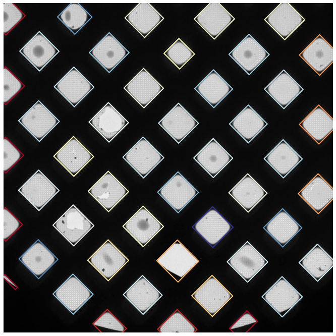
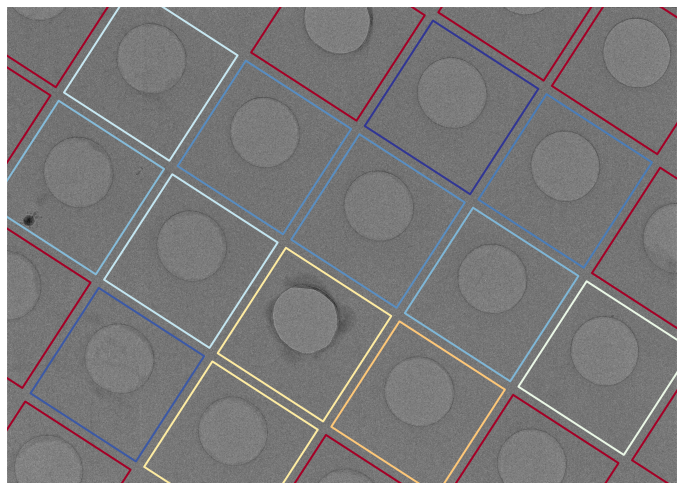

# Ptolemy
A Python machine learning and computer vision library for automating cryo-EM data collection. The accompanying paper is available on [arxiv](https://arxiv.org/abs/2112.01534). Ptolemy is designed to handle localization and scoring of squares in low-mag images (pixelsize of around 2000-5000 Angstroms/pixel) and holes in medium-mag images (100-1000 angstroms/pixel). It works on both gold and carbon holey, untilted grids. 

Example Low Mag Image

  
  
  

Example Med Mag Image

  
  
  

## Functionality
Images and visualization are handled by the `Exposure` class in `ptolemy/images.py`, with algorithms for processing low and medium mag images in `ptolemy/algorithms.py`. The workflow is outlined in the tutorial notebooks. 

## Future
We plan to improve Ptolemy with active learning on individual data collection sessions, support for tilted grids, and superresolution (unbinned) medium-mag images.

## Dependencies
Tested with python 3.9

- pytorch
- torchvision
- numpy
- pandas
- scipy
- scikit-learn
- matplotlib
- scikit-image
- uvicorn
- fastapi
- pydantic
- gpytorch

## License
This work is licensed under the Creative Commons Attribution-NonCommercial 4.0 International License. To view a copy of this license, visit http://creativecommons.org/licenses/by-nc/4.0/ or send a letter to Creative Commons, PO Box 1866, Mountain View, CA 94042, USA.
